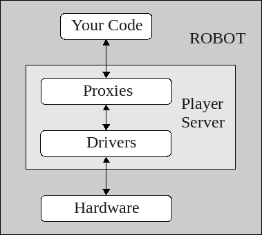
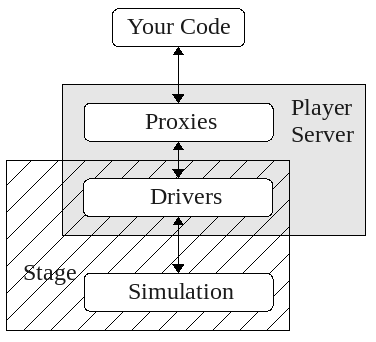

To learn how to write code for Player or Player/Stage it helps to
understand the basic structure of how Player works. Player uses a
Server/Client structure in order to pass data and instructions between your
code and the robot's hardware. Player is a server, and a hardware device.
Remember, a device is a piece of hardware that uses a driver which conforms
to an interface. See [Section 2.2 - Interfaces, Drivers, and
Devices](BASICS.md#22-interfaces-drivers-and-devices).  On the robot is
subscribed as a client to the server via a thing called a
*proxy*. The .cfg file associated with your robot (or your simulation)
takes care of telling the Player server which devices are attached to it,
so when we run the command `player some_cfg.cfg` this starts up the Player
server and connects all the necessary hardware devices to the server.

Figure 5.1 shows a basic block diagram of
the structure of Player when implemented on a robot. In Player/Stage the
same command will start the Player server and load up the worldfile in a
simulation window, this runs on your computer and allows your code to
interact with the simulation rather than hardware. Figure
5.2 shows a basic block diagram of the
Player/Stage structure.  Your code must also subscribe to the Player server
so that it can access these proxies and hence control the robot. Player has
functions and classes which will do all this for you, but you still need to
actually call these functions with your code and know how to use them.

<!--- Figure --->
| |
| :---------------:| 
|  |
| Figure 5.1: The server/client control structure of Player when used on a robot. There may be several proxies connected to the server at any time. |
<!---  --->

<!--- Figure --->
| |
| :---------------:| 
|  |
| Figure 5.2: The server/client control structure of Player/Stage when used as a simulator. There may be several proxies connected to the server at any time. |

## 5.1 Types of controllers
Player is compatable with C, C++ or Python player controllers.  The
official documentation for each can be found at:

* libplayerc - [http://playerstage.sourceforge.net/doc/Player-3.0.2/player/group__player__clientlib__libplayerc.html](http://playerstage.sourceforge.net/doc/Player-3.0.2/player/group__player__clientlib__libplayerc.html)
* libplayerc++ - [http://playerstage.sourceforge.net/doc/Player-3.0.2/player/group__player__clientlib__cplusplus.html](http://playerstage.sourceforge.net/doc/Player-3.0.2/player/group__player__clientlib__cplusplus.html)
* python bindings for libplayerc - [http://playerstage.sourceforge.net/doc/Player-3.0.2/player/group__player__clientlib__libplayerc__py.html](http://playerstage.sourceforge.net/doc/Player-3.0.2/player/group__player__clientlib__libplayerc__py.html)
* python bindings for libplayerc++ - not separately documented, see the
  libplayerc++ documentation.

There are also such things as "stage controllers" such as those distributed in
the stage source code under `examples/ctrl`, but in this manual we'll only
describe player controllers.
Earlier versions of `simple.world` had a line `ctrl wander` that
automatically started the simulated robot working with a stage controller.
If you happen to encounter this `simple.world` file, just comment out that
line to use the examples given here.  Player controllers can control a real or
a simulated robot.

We will start in [Chapter 6](CONTROLLER_CPP.md) by using C++ since it's
pretty general.  Then, we'll cover C controllers in 
[Chapter 7](CONTROLLER_C.md), and Python controllers in 
[Chapter 8](CONTROLLER_PYCPP.md) and [Chapter 9](CONTROLLER_PYC.md)

The process of writing Player code is mostly the same for each different
language though. The libplayerc and libplayercpp proxy functions have
different names for each language, but work in more or less the same way,
so even if you don't plan on using C++ or Stage this section will still
contain helpful information.  

## 5.2 Example Controllers

Some example controllers in various languages can be found in the Player
source code under `examples/`.  These and more are documented at
[http://playerstage.sourceforge.net/wiki/PlayerClientLibraries](http://playerstage.sourceforge.net/wiki/PlayerClientLibraries).

Some matlab and python examples based on this manual are given at
[http://turobotics.blogspot.com/2013/08/client-controllers-for-player-302-and.html](http://turobotics.blogspot.com/2013/08/client-controllers-for-player-302-and.html).

## 5.3 Wrap your code!
Before beginning a project it is highly recommended that for any programs
other than basic examples you should always wrap your Player commands
around your own functions and classes so that all your code's interactions
with Player are kept together the same file. This isn't a requirement of
Player, it's just good practice. For example, if you upgrade Player or if
for some reason your robot breaks and a certain function no longer works
you only have to change part of a file instead of searching through all
your code for places where Player functions have been used.

