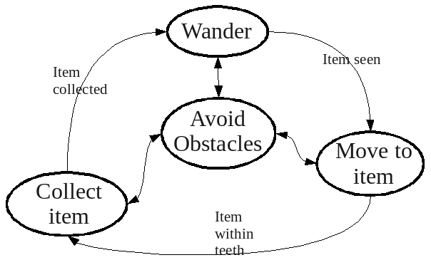
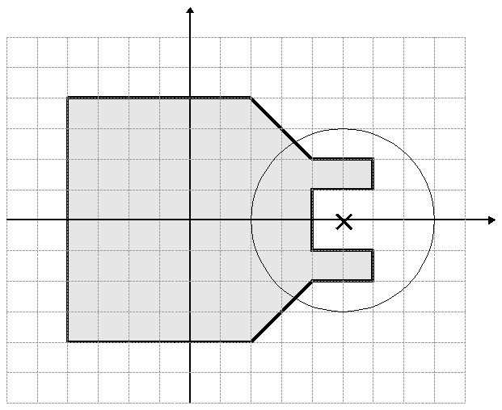

In [Chapter 6](CONTROLLER_CPP.md) only C++ was used as an example.  Since
Player interacts with controlling code over network sockets, it's pretty
easy to control robots (physical or simulated) with other languages as
well.  Player officially supports C++, C, and Python (see 
[http://playerstage.sourceforge.net/doc/Player-3.0.2/player/group__clientlibs.html](http://playerstage.sourceforge.net/doc/Player-3.0.2/player/group__clientlibs.html)).
There are also [Third party
libraries](http://playerstage.sourceforge.net/wiki/PlayerClientLibraries)
with support for clients ranging from Smalltalk to Java to MATLAB.

In this chapter, I will review the same examples given in
[Chapter 6](CONTROLLER_CPP.md) for C++, hilighting the differences in the
new language.  Then, I will provide a new version of the 
[Trash Zapping Robot](CONTROLLER_CPP.md#65-using-proxies-case-study-1-using-c-for-a-trash-zapping-robot)
for each.

# 7.1 - Getting Started

If you are coding in C use the following command to compile:
```
gcc -o simple `pkg-config --cflags playerc` simple.c `pkg-config --libs playerc`
```

An even easier and more general way is to make a `Makefile` that
explains how to compile your code for you.  The [details of Makefiles](http://www.gnu.org/software/make/manual/make.html) are
beyond the scope of this manual, but an example is given in the tutorial
files that came with this manual.  If you have this `Makefile` in the
same directory as your code, you can just type `make file` and the make
program will search for `file.c` and "do the right thing".

## TRY IT OUT (Minimal C Controller)
This is a minimal controller, written in C, almost identical to the one
distributed with player.  It goes forward and does very simple collision
avoidance based on the sonars.

Read through the code before executing.  

```tiobox
> cd <source_code>/Ch7.1
> player simple.cfg
> make simple 
> ./simple
```

# 7.2 - Connecting to the Server and Proxies With Your Code

The first thing to do within your code is to include the Player header
file. Assuming Player/Stage is installed correctly on your machine then
this can be done with the line 
```
#include <libplayerc/playerc.h>
```

Next we need to establish a Player Client, which will interact with the
Player server for you. To do this we use the lines:
```
playerc_client_t *client;
client = playerc_client_create(NULL, "localhost", 6665);
```
What this does is declare a new object which is a playerc_client called
`client` which connects to the Player server at the given address. The
hostname and port is like that discussed in [Section 4.1 - Device Address](#41-device-addresses). If your code is running on the
same computer (or robot) as the Player server you wish to connect to then
the hostname is "localhost" otherwise it will be the IP address of the
computer or robot. The port is an optional parameter usually only needed
for simulations, it will be the same as the port you gave in the .cfg file.
This is only useful if your simulation has more than one robot in and you
need your code to connect to both robots. So if you gave your first robot
port 6665 and the second one 6666 (like in the example of
[Section 4.2 - Putting the Configuration File Together](CFGFILES.md#42-putting-the-configuration-file-together)) then you would need two
player clients, one connected to each robot, and you would do this with the
following code: 
```
client1 = playerc_client_create(NULL, "localhost", 6665);
client2 = playerc_client_create(NULL, "localhost", 6666);
```
If you are only using one robot and in your .cfg file you said that it
would operate on port 6665 then the port parameter to the player client
constructor is not needed. 

Once we have established a player client we should connect our code to the
device proxies so that we can exchange information with them. Which proxies
you can connect your code to is dependent on what you have put in your
configuration file. For instance if your configuration file says your robot
is connected to a laser but not a camera you can connect to the laser
device but not the camera, even if the robot (or robot simulation) has a
camera on it. 

Proxies take the name of the interface which the drivers use to talk to
Player. Let's take part of the Bigbob example configuration file from
[Section 4.2 - Putting the Configuration File Together](CFGFILES.md#42-putting-the-configuration-file-together)):
```
driver
(
  name "stage"
  provides ["position2d:0" 
            "ranger:0" 
            "blobfinder:0" 
            "ranger:1" ]
)
```
Here we've told the Player server that our "robot" has devices which use the
position2d, ranger, and blobfinder interfaces. In our code then, we should
connect to the position2d, ranger, and blobfinder proxies like so:
```
position2d_name = playerc_position2d_create(client_name, index);
playerc_position2d_subscribe(position2d_name, PLAYER_OPEN_MODE);

ranger_name = playerc_ranger_create(client_name,index);
playerc_ranger_subscribe(ranger_name,PLAYER_OPEN_MODE);

blobfinder_name = playerc_blobfinder_create(client_name,index);
playerc_blobfinder_subscribe(blobfinder_name,PLAYER_OPEN_MODE);
```
A full list of which proxies PlayerC supports can be found in the [Player
manual](http://playerstage.sourceforge.net/doc/Player-3.0.2/player/group__playerc__proxies.html)
they all follow the convention of being named after the interface they use.
In the above case `proxy_name` is the name you want to give to the
proxy object, `client_name` is the name you gave the playerc_client
object earlier and `index` is the index that the device was given in
your configuration file (probably 0).

## 7.2.1 - Setting Up Connections: an Example.

For an example of how to connect to the Player sever and device proxies we
will use the example configuration file developed in 
[Section 4.2 - Putting the Configuration File Together](CFGFILES.md#42-putting-the-configuration-file-together). For convenience this is reproduced below:
```
driver
(		
      name "stage"
      plugin "stageplugin"

      provides ["simulation:0" ]

      # load the named file into the simulator
      worldfile "worldfile_name.world"	
)      

driver
(
      name "stage"
      provides ["6665:position2d:0" 
            "6665:ranger:0" 
            "6665:blobfinder:0" 
            "6665:ranger:1"]
      model "bob1" 
)
```
To set up a player client and then connect to proxies on that server we
can use principles discussed in this section to develop the following code:
```
#include <stdio.h>
#include <libplayerc/playerc.h>

int main(int argc, char *argv[])
{
  playerc_client_t *robot;

  /* Create a client and connect it to the server. */
  robot = playerc_client_create(NULL, "localhost", 6665);
  if (0 != playerc_client_connect(robot)) return -1;

  /* Create and subscribe to a position2d device. */
  p2dProxy = playerc_position2d_create(robot, 0);
  if (playerc_position2d_subscribe(p2dProxy, PLAYER_OPEN_MODE)) return -1;

  /* Create and subscribe to a ranger (sonar) device. */
  sonarProxy = playerc_ranger_create(robot, 0);
  if (playerc_ranger_subscribe(sonarProxy, PLAYER_OPEN_MODE)) return -1;

  /* Create and subscribe to a blobfinder device. */
  BlobfinderProxy = playerc_blobfinder_create(robot, 0);
  if (playerc_blobfinder_subscribe(BlobfinderProxy, PLAYER_OPEN_MODE)) return -1;

  /* Create and subscribe to a ranger (laser) device. */
  laserProxy = playerc_ranger_create(robot, 1);
  if (playerc_ranger_subscribe(laserProxy, PLAYER_OPEN_MODE)) return -1;

  /*some control code */
  return 0;
}
```

# 7.3 - Interacting with Proxies 

As you may expect, each proxy is specialised towards controlling the device
it connects to. This means that each proxy will have different commands
depending on what it controls.  In Player version 3.0.2 there are 39
different proxies which you can choose to use, many of which are not
applicable to Player/Stage. This manual will not attempt to explain them
all, a full list of avaliable proxies and their
functions is in the [Player manual](
http://playerstage.sourceforge.net/doc/Player-3.0.2/player/group__playerc__proxies.html), although the returns, parameters and purpose of the proxy function is not always explained. 

The following few proxies are probably the most useful to anyone using
Player or Player/Stage.

## 7.3.1 - position2dproxy
The position2dproxy is the number one most useful proxy there is. It
controls the robot's motors and keeps track of the robot's odometry (where
the robot thinks it is based on how far its wheels have moved).

### 7.3.1.1 - SetSpeed ( )
The SetSpeed command is used to tell the robot's motors how fast to turn.
There are three different SetSpeed commands that can be called, one is
for robots that can move in any direction (omnidirectional), one is for for
robots with differential drive (i.e. one drive wheel on each side), and the
last for car-like drives. 

* `playerc_position2d_set_cmd_vel (playerc_position2d_t *device, double
  XSpeed, double YSpeed, double YawSpeed, int state)`
* `playerc_position2d_set_cmd_vel_head (playerc_position2d_t *device,
  double XSpeed, double YSpeed, double YawHeading, int state)`
* `playerc_position2d_set_cmd_car (playerc_position2d_t *device, double
  XSpeed, double SteerAngle)`

<!--- Figure --->
| |
| :---------------:| 
|  |
| Figure 7.3: A robot on a cartesian grid. This shows what directions the X and Y speeds will cause the robot to move in. A positive yaw speed will turn the robot in the direction of the + arrow, a negative yaw speed is the direction of the - arrow. |


Figure 7.3 
shows which direction the x, y and yaw speeds are in relation to the robot.
The x speed is the rate at which the robot moves forward and the y speed is
the robot's speed sideways, both are to be given in metres per second. The
y speed will only be useful if the robot you want to simulate or control is
onidirectional, since robots with standard wheels cannot move sideways. The
yaw speed controls how fast the robot is turning and is given in radians
per second.
Player has an inbuilt global function called `dtor()` which converts a
number in degrees into a number in radians which could be useful when
setting the yaw speed. 

If you want to simulate or control a robot with a
differential drive system then you'll need to convert left and right wheel
speeds into a forward speed and a turning speed before sending it to the
proxy. For car-like drives there is the `SetCarlike` which, again is
the forward speed in m/s and the drive angle in radians.

### 7.3.1.2 - GetSpeed ( )
With playerc, there are no explicit GetSpeed comments - you just read from
the relevant fields in the `playerc_position2d_t` strucure.

* `device->vx`: forward speed (metres/sec).
* `device->vy`: sideways (perpendicular) speed (metres/sec).
* `device->va`: turning speed (radians/sec).


### 7.3.1.3 - Get_Pos ( )
Again, in playerc these fields are read directly from the `playerc_position2d_t`
structure.

This allows you to monitor where the robot thinks it is. Coordinate values
are given relative to its starting point, and yaws are relative to its
starting yaw. 

* `device->px`: gives current x coordinate relative to its x starting position.
* `device->py`: gives current y coordinate relative to its y starting position.
* `device->pa`: gives current yaw relative to its starting yaw.


### TRY IT OUT (GetSetPositions)
This example shows how to get and set positions.  
Read through the code before executing.  

```tiobox
> cd <source_code>/Ch7.3
> player bigbob7.cfg &
> make bigbob8
> ./bigbob8
```

In [Section 3.2.1 - The Position Model](WORLDFILES.md#3217-position), we
specified whether it would record odometry by measuring how much its wheels
have turned, or whether the robot would have perfect knowledge of its
current coordinates (by default the robot does not record odometry at all).
If you set the robot to record odometry using its wheels then the positions
returned by these get commands will become increasingly inaccurate as the
simulation goes on. If you want to log your robots position as it moves
around, these functions along with the perfect odometry setting can be used. 

### 7.3.1.4 - Motor Enable
The `playerc_position2d_enable(device, enable)` fuction takes a boolean
input, telling Player whether to enable the
motors or not. If the motors are disabled then the robot will not move no
matter what commands are given to it, if the motors are enabled then the
motors will always work, this is not so desirable if the robot is on a desk
or something and is likely to get damaged. Hence the motors being enabled
is optional. If you are using Player/Stage, then the motors will always be
enabled and this command doesn't need to be run. However, if your code is
ever likely to be moved onto a real robot and the motors are not explicitly
enabled in your code, then you may end up spending a long time trying to
work out why your robot is not working.

## 7.3.2 - rangerproxy

A RangerProxy interfaces with any ranger sensor.  

A laser is represented by a ranger device with one ranger sensor, whose
`samples` attribute is greater than one.  To minimize confusion with
the depreciated laser interface, I'll refer to these as single-sensor
devices.  A set of sonars or IR sensors is represented by a ranger device
with multiple ranger sensors whose `samples` attributes are not set (or
set to 1).  To minimize confusion with the depreciated sonar and IR
interfaces, I'll refer to these as multiple-sensor devices.

Angles are given with reference to the laser's centre front (see Figure
7.4).

* `playerc_ranger_get_geom()`: Retrieves the configuration of the ranger
  sensor, and fills in the [playerc_ranger_t](http://playerstage.sourceforge.net/doc/Player-3.0.2/player/structplayerc__ranger__t.html)
  structure.  The most useful elements of this structure are:
    * `ranges_count`: The number of ranger measurements that
      the sensor suite measures.  In the case of a single-sensor
      device, this is given by the `samples` attribute.  In the
      case of a multiple-sensor device, this is given by the number
      of sensors.
    * `ranges[ranger_number]`: 
          The range returned by the `ranger_number`*th* scan
          point. For a single-sensor device, scan points are numbered
          from the minimum angle at index 0, to the maximum angle at
          index `ranges_count`.
          For a multiple-sensor device, the `ranger_number` is
          given by the order in which you included the sensor.
    * `min_angle`: gives the minimum angle covered by a ranger sensor.
            Only makes sense for a single-sensor device.
    * `max_angle`: gives the maximum angle covered by a
        ranger sensor.  Only makes sense for a single-sensor device.
    * `bearings[ranger_number]`: scan bearings in the XY plane (See Figure
      7.4)

<!--- Figure --->
| |
| :---------------:| 
|  |
| Figure 7.4: How laser angles are referenced. In this diagram the laser is pointing to the right along the dotted line, the angle &theta; is the angle of a laser scan point, in this example &theta; is negative. |


<!--- Figure --->
| |
| :---------------:| 
|  |
| Figure 7.5: A laser scanner. The minimum angle is the angle of the rightmost laser scan, the maximum angle is the leftmost laser scan.  &theta; is the scan resolution of the laser, it is the angle between each laser scan, given in radians. |


#### TRY IT OUT (Ranger)
This example shows how ranger sensors can be read.
Read through the code before executing.  

```tiobox
> cd <source_code>/Ch7.3
> player bigbob7.cfg &
> make bigbob9
> ./bigbob9
```

## 7.3.3 - BlobfinderProxy 

The blobfinder module analyses a camera image for areas of a desired colour
and returns a structure `playerc_blobfinder_t`.  This structure contains
very few elements:

* `width` - Width of image (pixels)
* `height` - Height of image (pixels)
* `blobs_count` - the number of blobs seen
* `blobs` - a pointer to an array of `playerc_blobfinder_blob_t`
  structures.

So for a blobfinder proxy blobfinder, the blobs are given by 
* `blobfinder->blobs[blob_number]`: This returns the blob structure data
  for the blob with the index `blob_number`. Blobs are sorted by index in
  the order that they appear in the image from left to right. This can also
  be achieved with the BlobfinderProxy function `GetBlob(blob_number)`.

Once we receive the blob structure from the proxy we can extract data we
need. The `playerc_blobfinder_blob_t` structure, documented in the [Player
manual](http://playerstage.sourceforge.net/doc/Player-3.0.2/player/structplayer__blobfinder__blob.html)
contains the following fields (see Figure 6.6 for illustration):

* `color`: The colour of the blob it detected. This is given as a hexadecimal value.
* `area`: The area of the blob's bounding box. (In
    Stage 4.1.1, there is a bug with respect to the area.  It is
    computed as an `int`, but return as an `unsigned int`.  In order to use
    it, you must explicitly cast it as an int (`(int)area`).  See
    [http://sourceforge.net/p/playerstage/bugs/362/](http://sourceforge.net/p/playerstage/bugs/362/) and/or
    [https://github.com/rtv/Stage/issues/41](https://github.com/rtv/Stage/issues/41) for the details.
* `x`: The horizontal coordinate of the geometric centre of the
  blob's bounding box 
* `y`: The vertical coordinate of the geometric centre of the
  blob's bounding box 
* `left`: The horizontal coordinate of the left hand side of the
  blob's bounding box 
* `right`: The horizontal coordinate of the right hand side of the
  blob's bounding box 
* `top`: The vertical coordinate of the top side of the blob's
  bounding box
* `bottom`: The vertical coordinate of the bottom side of the
  blob's bounding box

<!--- Figure --->
| |
| :---------------:| 
|  |
| Figure 7.6: What the fields in `playerc_blobfinder_blob_t` mean. The blob on the left has a geometric centre at *(x,y)*, the blob on the right has a bounding box with the top left corner at *(left, top)* pixels, and a lower right coordinate at *(right, bottom)* pixels. Coordinates are given with reference to the top left corner of the image. |

### TRY IT OUT (blobfinder)
This example shows how to extract info from a blobfinder.
Read through the code before executing.  
```tiobox
> cd <source_code>/Ch7.3
> player bigbob7.cfg &
> make bigbob10
> ./bigbob10
```

## 7.3.4 - GripperProxy 
The GripperProxy allows you to control the gripper, once the gripper is
holding an item, the simulated robot will carry it around wherever it goes.
Without a gripper you can only jostle an item in the simulation and you
would have to manually tell the simulation what to do with an item. The
GripperProxy can also tell you if an item is between the gripper teeth
because the gripper model has inbuilt beams which can detect if they are
broken. 

* `playerc_gripper_open_cmd (playerc_gripper_t *device)`: 
      Tells the gripper to open. This will cause any items that were being carried to be dropped.
* `playerc_gripper_close_cmd (playerc_gripper_t *device)`: Command the gripper to close. 
      Tells the gripper to close. This will cause it to pick up anything between its teeth.
* `playerc_gripper_stop_cmd (playerc_gripper_t *device)`: Command the gripper to stop. If it is opening, it may not complete opening.  If it's closing, it may not complete closing.
* `playerc_gripper_store_cmd (playerc_gripper_t *device)`: Command the gripper to store.   Any objects between the gripper's teeth is stored in a hypothetical sstorage, if there is still capacity (it dissapears from the world).
* `playerc_gripper_retrieve_cmd (playerc_gripper_t *device)`: Command the gripper to retrieve.   If there is a stored object in the storage, it re-appears in the gripper.
* `playerc_gripper_printout (playerc_gripper_t *device, const char *prefix)`: Print a human-readable version of the gripper state. 
* `playerc_gripper_get_geom (playerc_gripper_t *device)`: Get the gripper
  geometry.  This is placed in the `playerc_gripper_t` structure, which 
  contains the following information:
    * `num_beams`: The number of breakbeams the gripper has. 
    * `capacity`: The capacity of the gripper's store - if 0, the gripper cannot
      store. 
    * `state`: The gripper's state: may be one of PLAYER_GRIPPER_STATE_OPEN,
        PLAYER_GRIPPER_STATE_CLOSED, PLAYER_GRIPPER_STATE_MOVING or
        PLAYER_GRIPPER_STATE_ERROR. 
    * `beams`: The position of the object in the gripper. 
             This command will tell you if there is an item inside the
             gripper. If it is a value above 0 then there is an item to grab.
    * `stored`: The number of currently-stored objects. 

### TRY IT OUT (gripper)
This example shows a robot approaching a box, gripping it, and dragging it
backwards.
Read through the code before executing.  

```tiobox
> cd <source_code>/Ch7.3
> player bigbob11.cfg &
> make bigbob11
> ./bigbob11
```

## 7.3.5 - SimulationProxy
The simulation proxy allows your code to interact with and change aspects of the simulation, such as an item's pose or its colour. 

### 7.3.5.1 - Get/Set Pose
The item's pose is a special case of the Get/SetProperty function, because
it is so likely that someone would want to move an item in the world they
created a special function to do it.

```
playerc_simulation_set_pose2d (playerc_simulation_t *device, char *item_name, 
                               double gx, double gy, double ga)
```

In this case `item_name` is as with get/set_property, but we can directly
specify its new coordinates and yaw (coordinates and yaws are given with
reference to the map's origin).

```
playerc_simulation_get_pose2d (playerc_simulation_t *device, char *identifier, 
                               double *x, double *y, double *a) 
```

This is like set_pose2d only this time it writes the coordinates and yaw to
the given addresses in memory.

### TRY IT OUT (GetSetPose)
```tiobox
> cd <source_code>/Ch7.3 
> player bigbob11.cfg 
> make bigbob12 
> ./bigbob12
```

### 7.3.5.2 - Get/Set Property
In version 4.1.1 of Stage the get/set_property simulation proxy functions
are only implemented for the property "color".  None of the other
properties are supported.  Previous versions of Stage (before 3.2.2) had
some code but it wasn't fully implemented, and it's been removed since.

If you desperately need this functionality you can use an earlier release
of Stage, and the first edition of this manual describes how to get and
set a model`s property in those distributions.  

In this edition of the manual I will describe the only functioning
get/set_property, which is "color".

To retrieve or change a property of an item in the simulation we use the
following functions:
```
playerc_simulation_get_property (playerc_simulation_t *device, 
                                char *item_name, char *property, void *value, size_t value_len)
playerc_simulation_set_property (playerc_simulation_t *device, 
                                char *item_name, char *property, void *value, size_t value_len)
```

* `item_name`: this is the name that you gave to the object in the
  worldfile, it could be *any* model that you have described in the
  worldfile. For example, in [This Example](WORLDFILES.md#322-an-example-robot) in the
  worldfile we declared a Bigbob type robot which we called
  "bob1" so the `item_name` for that object is "bob1". Similarly
  in [Section 3.2.3 - Building Other Stuff](WORLDFILES.md#323-building-other-stuff) we built some
  models of oranges and called the "orange1" to "orange4" so
  the item name for one of these would be "orange1". Anything
  that is a model in your worldfile can be altered by this
  function, you just need to have named it, no drivers need to be
  declared in the configuration file for this to work either. We
  didn't write controllers for the oranges but we could still alter
  their properties this way.
* `property`: Currently, `"_mp_color"` is the only supported property about
   a model that you can change.  
* `value`: a pointer to the value you want fill with the property or assign to the property (see below).
* `value_len`: is the size of the value you gave in bytes. This can easily
* `value_len`: is the size of the value you gave in bytes. This can easily be found with the C or C++ `sizeof()` operator.

The `value` parameter is dependant on which `property` you want to set.

* `"color"`: This requires an array of four `float` values, scaled between
  0 and 1. The first index of the array is the red component of the colour,
  the second is the green, third is blue and fourth is alpha (how light or
  dark the colour is, usually 1). For example if we want a nice shade of
  green, which has RGB components 171/224/110 we scale these between 0 and
  1 by dividing by 255 to get 0.67/0.88/0.43 we can now put this into a
  float array with the line `float green[]={0.67, 0.88, 0.43, 1};`. This
  array can then be passed into our `SetProperty` function like so:
	`playerc_simulation_set_property(sp,(char *)"puck1",(char*)"color",green,4*sizeof(float));`

### TRY IT OUT (GetSetProperty)
This example shows how to reset the color of an object.
Read through the code before executing.  

```tiobox
> cd <source_code>/Ch7.3
> player bigbob11.cfg &
> make bigbob13
> ./bigbob13
```

		
# 7.4 - General Useful Commands

## 7.4.1 - read( )
To make the proxies update with new sensor data we need to tell the player
server to update, we can do this using the playerc_client object which we used
to
connect to the server. All we have to do is run the command
`playerc_client_read(playerc_client_name)` every time the data needs updating
(where playerc_client_name is the name you gave the player client object).
Until this command is run, the proxies and any sensor information from them
will be empty.  The devices on a typical robot are asynchronous and the devices
in a Player/Stage simulation are also asynchronous, so running the `read()`
command
won't always update everything at the same time, so it may take several calls
before some large data structures (such as a camera image) gets updated.

## 7.4.2 - getgeom()
Most of the proxies have a function called `get_geom` or `get_geometry` or
`request_geometry`, or words to that effect. What these functions do is tell
the proxy to retrieve information about the device, usually its size and pose
(relative to the robot). The proxies don't know this by default since this
information is specific to the robot or the Player/Stage robot model. If your
code needs to know this kind of information about a device then the proxy must
run this command first.

# 7.5 - Using Proxies: Case Study: using C for a Trash-Zapping Robot

To demonstrate how to write code to control a Player device or Player/Stage
simulation we will use the example robot "Bigbob" developed in
[Section 3.2.2 - An Example Robot](WORLDFILES.md#322-an-example-robot)
and
[Section 4.2 - Putting the Configuration File Together](CFGFILES.md#42-putting-the-configuration-file-together)) 
which collects oranges and juice cartons from a factory floor. In previous
sections we have developed the Stage model for this robot and its
environment and the configuration file to control it. Now we can begin to
put everything together to create a working simulation of this robot.

## 7.5.1 - The Control Architecture 
To zap rubbish we have three basic behaviours: 

* Wandering: to search for rubbish. 
* Moving towards item: for when an item is spotted and the robot wants to zap it
* Collecting item: for dealing with zapping items.

The robot will also avoid obstacles but once this is done it will switch
back to its previous behaviour. The control will follow the state
transitions shown in Figure 7.7.

<!--- Figure --->
| |
| :---------------:| 
|  |
| Figure 7.7: The state transitions that the Bigbob rubbish zapping robot will follow. |

## 7.5.2 -  Beginning the Code 

In [Section 7.2 - Connecting to Server](#72-connecting-to-the-server-and-proxies-with-your-code) we discussed how to connect to the Player server and proxies attached to the server, and developed the following code:
```
#include <stdio.h>
#include <libplayerc/playerc.h>

int main(int argc, char *argv[])
{	
	  playerc_client_t *robot;
	  playerc_position2d_t *p2dProxy;
	  playerc_ranger_t *sonarProxy;
	  playerc_blobfinder_t *blobProxy;
	  playerc_ranger_t *laserProxy;
	  playerc_simulation_t *simProxy;

	  /* Create a client and connect it to the server. */
	  robot = playerc_client_create(NULL, "localhost", 6665);
	  if (0 != playerc_client_connect(robot)) return -1;

	  /* Create and subscribe to devices. */
	  p2dProxy = playerc_position2d_create(robot, 0);
	  if (playerc_position2d_subscribe(p2dProxy, PLAYER_OPEN_MODE)) return -1;
	  sonarProxy = playerc_ranger_create(robot, 0);
	  if (playerc_ranger_subscribe(sonarProxy, PLAYER_OPEN_MODE)) return -1;
	  blobProxy = playerc_blobfinder_create(robot, 0);
	  if (playerc_blobfinder_subscribe(blobProxy, PLAYER_OPEN_MODE)) return -1;
	  laserProxy = playerc_ranger_create(robot, 1);
	  if (playerc_ranger_subscribe(laserProxy, PLAYER_OPEN_MODE)) return -1;
	  simProxy = playerc_simulation_create(robot, 0);
	  if (playerc_simulation_subscribe(simProxy, PLAYER_OPEN_MODE)) return -1;

	  /* some control code */

}
```
Using our knowledge of the proxies discussed in 
[Section 7.3 - Interacting with Proxies](#73-interacting-with-proxies) we can build controlling code on top of this basic code. 
Firstly, it is good practice to enable the motors and request the geometry for all the proxies. This means that the robot will move and that if we need to know about the sensing devices the proxies will have that information available.
```
      //enable motors
	  playerc_position2d_enable(p2dProxy,1);

      //request geometries
	  playerc_position2d_get_geom(p2dProxy);
	  playerc_ranger_get_geom(sonarProxy);
	  playerc_ranger_get_geom(laserProxy);
      //blobfinder doesn't have geometry
```

Once things are initialised we can enter the main control loop. At this point we should tell the robot to read in data from its devices to the proxies.
```
while(true)
{
	/* read from the proxies */
	playerc_client_read(robot);

    /*control code*/
}
```

## 7.5.3 - Wander

First we will initialise a couple of variables which will be the forward
speed and the turning speed of the robot.
```
double forwardSpeed, turnSpeed;
```

Let's say that Bigbob's maximum speed is 1 metre/second and it can turn 90
degrees a second. We will write a small subfunction to randomly assign forward and turning speeds between 0 and the maximum speeds.
```
void Wander(double *forwardSpeed, double *turnSpeed)
{
      int maxSpeed = 1;
      int maxTurn = 90;
      double fspeed, tspeed;
	
      //fspeed is between 0 and 10
      fspeed = rand()%11;
      //(fspeed/10) is between 0 and 1
      fspeed = (fspeed/10)*maxSpeed;
	
      tspeed = rand()%(2*maxTurn);
      tspeed = tspeed-maxTurn;
      //tspeed is between -maxTurn and +maxTurn
	
      *forwardSpeed = fspeed;
      *turnSpeed = tspeed;
} 
```
In the control loop we include a call to this function and then set the resulting speeds to the motors.
```
while(true)
{		
      // read from the proxies
	  playerc_client_read(robot);

      //wander
      Wander(&forwardSpeed, &turnSpeed);

      //set motors
	  playerc_position2d_set_cmd_vel(p2dProxy, forwardSpeed, 0.0, DTOR(turnSpeed), 1);
}
```
The `dtor()` function is a Player function that turns a number in degrees into a number in radians. Our calculations have been done in degrees but `SetSpeed` requires radians, so this function is used to convert between the two.
At present the motors are being updated every time this control loop
executes, and this leads to some erratic behaviour from the robot. Using
the `sleep()` command we will tell the control loop to wait one
second between each execution. 
`sleep()` is a standard C function and is included in
the `unistd.h` header. 

At this point we should also seed the random
number generator with the current time so that the wander behaviour isn't
exactly the same each time. For the sleep command we will need to include
`unistd.h` and to seed the random number generator with the current
system time we will need to include `time.h`.  
```
#include <stdio.h>
#include <unistd.h>
#include <time.h>
#include <libplayerc/playerc.h>

void Wander(double *forwardSpeed, double *turnSpeed)
{
      //wander code...
} 

int main(int argc, char *argv[])
{	
      //connect to proxies
      double forwardSpeed, turnSpeed;
	
      srand(time(NULL));
	
      //enable motors
      //request geometries
	
      while(true)
      {		
            // read from the proxies
			playerc_client_read(robot);

            //wander
            Wander(&forwardSpeed, &turnSpeed);
		
            //set motors
  			playerc_position2d_set_cmd_vel(p2dProxy, forwardSpeed, 0.0, DTOR(turnSpeed), 1);
            sleep(1);
      }
}
```

## 7.5.4 - Obstacle Avoidance
Now we need to write a subfunction that checks the sonars for any obstacles and amends the motor speeds accordingly.
```
void AvoidObstacles(double *forwardSpeed, double *turnSpeed, 
      playerc_ranger_t *sproxy)
{
	  double *sp = sproxy->ranges; // pointer to range array

      //will avoid obstacles closer than 40cm
      double avoidDistance = 0.4;
      //will turn away at 60 degrees/sec
      int avoidTurnSpeed = 60;
      
      //left corner is sonar no. 2
      //right corner is sonar no. 3
      if(sp[2] < avoidDistance)
      {
            *forwardSpeed = 0;
            //turn right
            *turnSpeed = (-1)*avoidTurnSpeed;
            return;
      }
      else if(sp[3] < avoidDistance)
      {
            *forwardSpeed = 0;
            //turn left
            *turnSpeed = avoidTurnSpeed;
            return;
      }
      else if( (sp[0] < avoidDistance) && \
               (sp[1] < avoidDistance))
      {
            //back off a little bit
            *forwardSpeed = -0.2;
            *turnSpeed = avoidTurnSpeed;  
            return;
      }
      
      return; //do nothing
}
```
This is a very basic obstacle avoidance subfunction will update the motor
speeds only if there is an obstacle to avoid. If we call this function just
before sending data to the motors then it will overwrite any other
behaviours so that the obstacle will be avoided. Once the obstacle is no
longer in the way then the robot will continue as it was, this will allow
us to transition from any behaviour into obstacle avoidance and then back
again, as per the requirement of our control structure. All we need to do
now is call this function in our control loop:
```
while(true)
{		
    // read from the proxies
	playerc_client_read(robot);
		
    //wander
    Wander(&forwardSpeed, &turnSpeed);
		
    //avoid obstacles
    AvoidObstacles(&forwardSpeed, &turnSpeed, sonarProxy);
		
    //set motors
	playerc_position2d_set_cmd_vel(p2dProxy, forwardSpeed, 0.0, DTOR(turnSpeed), 1);
    sleep(1);
}
```

## 7.4.5 - Move To Item
For this state we want the robot to move towards a blob that it has spotted. There may be several blobs in its view at once, so we'll tell the robot to move to the largest one because it's probably the closest to the robot. The following subfunction finds the largest blob and turns the robot so that the blob's centre is near the centre of the image. The robot will then move towards the blob.
```
void MoveToItem(double *forwardSpeed, double *turnSpeed, 
      playerc_blobfinder_t *bfp)
{
      int i, centre;
      //how many blobs are there?
      int noBlobs = bfp->blobs_count;
      playerc_blobfinder_blob_t blob;
      int turningSpeed = 5; // in deg/s
      
      /*number of pixels away from the image centre a blob
      can be, to be in front of the robot. This is 
      essentially the margin of error.*/
      int margin = 10;

      //find the largest blob      
      int biggestBlobArea = 0;
      int biggestBlob = 0;
      
      for(i=0; i<noBlobs; i++)
      {
            //get blob from proxy
            playerc_blobfinder_blob_t currBlob = bfp->blobs[i];
            
            if( abs((int)currBlob.area) > biggestBlobArea)
            {
                  biggestBlob = i;
                  biggestBlobArea = abs((int)currBlob.area);
            }
      }
      blob = bfp->blobs[biggestBlob];
            
      // find centre of image
      centre = bfp->width/2;
      
      //adjust turn to centre the blob in image
      /*if the blob's centre is within some margin of the image 
      centre then move forwards, otherwise turn so that it is 
      centred. */
      //blob to the left of centre
      if(blob.x < centre-margin)
      {
            *forwardSpeed = 0;
            //turn left
            *turnSpeed = turningSpeed;
      }
      //blob to the right of centre
      else if(blob.x > centre+margin)
      {
            *forwardSpeed = 0;
            //turn right
            *turnSpeed = -turningSpeed;
      }
      //otherwise go straight ahead
      else
      {
            *forwardSpeed = 0.5;
            *turnSpeed = 0;      
      }
      
      return;
}
```

We want the robot to transition to this state whenever an item is seen, so we put a conditional statement in our control loop like so:
```
if(blobProxy->blobs_count == 0)
{
      //wander
      Wander(&forwardSpeed, &turnSpeed);
}
else
{
      //move towards the item
      MoveToItem(&forwardSpeed, &turnSpeed, blobProxy);
}
```

## 7.5.6 - Collect Item 
This behaviour will be the most difficult to code because Stage doesn't
support pushable objects (the required physics is far too complex), what
happens instead is that the robot runs over the object and just jostles it
a bit.  As a work-around to this problem we will have to somehow find out
which item is between Bigbob's teeth so that we can find its "name" and
then change that item's pose (for which we need the item's name) so that it
is no longer in the simulation. In essence, instead of having our robot eat
rubbish and store it within its body, what we are doing is making the laser
zap the rubbish out of existence.

We can find the name of an item between Bigbob's teeth by cross referencing
the robot's pose with the poses of the items in the world to find out which
item is nearest the robot's laser. The first step is to create a list of
all the items in the world, their names and their poses at initialisation.
Since we know the names of the items are "orange1" to "orange4" and
"carton1" to "carton4", we can find their poses with a simple call to a
simulation proxy. We'll have to connect to the simulation proxy with our
code first using the line `simProxy = playerc_simulation_create(robot, 0);`, then we can access this information and put it into a struct.
```
struct Item
{
      char name[16];
      double x;
      double y;
}typedef item_t;
```
We can populate the structure with information using the following code:
```
item_t itemList[8];

void RefreshItemList(item_t *itemList, playerc_simulation_t *simProxy)
{
      int i;
      	
      //get the poses of the oranges
      for(i=0;i<4;i++)
      {
            char orangeStr[] = "orange%d";
            sprintf(itemList[i].name, orangeStr, i+1);
            double dummy;  //dummy variable, don't need yaws.
	        playerc_simulation_get_pose2d(simProxy,itemList[i].name, \
	            &(itemList[i].x), &(itemList[i].y), &dummy);
      }
      	
      //get the poses of the cartons
      for(i=4;i<8;i++)
      {
            char cartonStr[] = "carton%d";
            sprintf(itemList[i].name, cartonStr, i-3);
            double dummy;  //dummy variable, don't need yaws.
	        playerc_simulation_get_pose2d(simProxy,itemList[i].name, \
	            &(itemList[i].x), &(itemList[i].y), &dummy);
      }
      
      return;
}
```
Here we are making a string of the item names, for example orange1 and
storing that in the item's name. We then use this string as an input into
the `get_pose2d` function so that we can also get the item's location in the simulation.

Next we can begin the "Collect Item" behaviour, which will be triggered
by something breaking the laser beam. When this happens we will check the
area around Bigbob's teeth, as indicated by Figure 7.8.   We know the
distance from the centre of this search circle to Bigbob's origin (0.625m)
and the radius of the search circle (0.375m), we can get the robot's exact
pose with the following code.  
```
double x, y, yaw;
playerc_simulation_get_pose2d(sim,(char*)"bob1", &x, &y, &yaw);
```
Cross referencing the robot's position with the item positions is a matter
of trigonometry, so isn't particularly relevant to a manual on Player/Stage. We
won't reproduce the code here, but the full and final code developed for
the Bigbob rubbish zapping robot can be found [at github](http://github.com/NickelsLab/Player-Stage-Manual/). The method
we used is to find the Euclidian distance of the items to the circle
centre, and the smallest distance is the item we want to destroy. We made a
subfunction called `FindItem` that returns the index of the item to be
destroyed.
(We could also equip BigBob with a gripper, and call `gripper.close()`, and haul the trash somewhere else to drop it off.  See
[GripperProxy](#gripperproxy) for more details, and `bigbob11` for an
example.)

<!--- Figure --->
| |
| :---------------:| 
|  |
| Figure 7.8: Where to look for items which may have passed through Bigbob's laser. |

Now that we can find the item to destroy it's fairly simple to trigger our subfunction when the laser is broken so we can find and destroy an item.
```
if(laserProxy[90] < 0.25)
{
      int destroyThis;

      /*first param is the list of items in the world
      second is length of this list
      third parameter is the simulation proxy with 
      the pose information in it*/
      destroyThis = FindItem(itemList, 8, simProxy);
 
      //move it out of the simulation
	  playerc_simulation_set_pose2d(simProxy,itemList[destroyThis].name, -10, -10, 0);
      RefreshItemList(itemList, simProxy);
}
```
The laser has 180 samples, so sample number 90 is the one which is perpendicular to Bigbob's teeth. This point returns a maximum of 0.25, so if its range was to fall below this then something has passed through the laser beam. We then find the item closest to the robot's teeth and move that item to coordinate *(-10, -10)* so it is no longer visible or accessible.

Finally we have a working simulation of a rubbish zapping robot! 
The code comprises the source `<source_code>/Ch7.5/bigbob.cc`, 
the simulation world `<source_code>/Ch7.5/bigbob.world`, and 
configuration file `<source_code>/Ch7.5/bigbob.cfg`.

#### TRY IT OUT (bigbob)
This example shows the final code for the trash-zapping robot.
Read through the code before executing.  
```tiobox
> cd <source_code>/Ch7.5
> player bigbob.cfg &
> make bigbob
> ./bigbob
```


# 7.6 - Simulating Multiple Robots

Our robot simulation case study only shows how to simulate a single robot in a Player/Stage environment. It's highly likely that a simulation might want more than one robot in it. In this situation you will need to build a model of every robot you need in the worldfile, and then its associated driver in the configuration file. Let's take a look at our worldfile for the case study, we'll add a new model of a new Bigbob robot called "bob2":
```
bigbob
(
	name "bob1"
	pose [-5 -6 45]
	color "green"
)

bigbob
(
	name "bob2"
	pose [5 6 225]
	color "yellow"
)
```

## 7.6.1 - Each robot on it's own port

If there are multiple robots in the simulation, the standard practice is to
put each robot on its own port (see [Section 4.1 - Device Address](#41-device-addresses). To implement this in the configuration file
we need to tell Player which port to find our second robot on:
```
driver( name "stage" 
        provides ["6665:position2d:0" "6665:ranger:0"
        "6665:blobfinder:0" "6665:ranger:1"] 
        model "bob1" )

driver( name "stage" 
        provides ["6666:position2d:0" "6666:ranger:0"
        "6666:blobfinder:0" "6666:ranger:1"] 
        model "bob2" )
```
If you plan on simulating a large number of robots then it is probably worth writing a script to generate the world and configuration files.

When Player/Stage is started, the Player server automatically connects to
all the used ports in your simulation and you control the robots separately
with different player client objects in your code. For instance:
```
	  /* First Robot */
	  playerc_client_t *robot;
	  playerc_position2d_t *p2dProxy;
	  playerc_ranger_t *sonarProxy;
	  playerc_blobfinder_t *blobProxy;
	  playerc_ranger_t *laserProxy;
	  playerc_simulation_t *simProxy;

	  /* Create a client and connect it to the server. */
	  robot = playerc_client_create(NULL, "localhost", 6665);
	  if (0 != playerc_client_connect(robot)) return -1;

	  /* Create and subscribe to devices. */
	  p2dProxy = playerc_position2d_create(robot, 0);
	  if (playerc_position2d_subscribe(p2dProxy, PLAYER_OPEN_MODE)) return -1;
	  sonarProxy = playerc_ranger_create(robot, 0);
	  if (playerc_ranger_subscribe(sonarProxy, PLAYER_OPEN_MODE)) return -1;
	  blobProxy = playerc_blobfinder_create(robot, 0);
	  if (playerc_blobfinder_subscribe(blobProxy, PLAYER_OPEN_MODE)) return -1;
	  laserProxy = playerc_ranger_create(robot, 1);
	  if (playerc_ranger_subscribe(laserProxy, PLAYER_OPEN_MODE)) return -1;
	  simProxy = playerc_simulation_create(robot, 0);
	  if (playerc_simulation_subscribe(simProxy, PLAYER_OPEN_MODE)) return -1;

	  /* Create a client and connect it to the server. */
	  robot2 = playerc_client_create(NULL, "localhost", 6666);
	  if (0 != playerc_client_connect(robot2)) return -1;

	  /* Second Robot */
	  playerc_client_t *robot2;
	  playerc_position2d_t *p2dProxy2;
	  playerc_ranger_t *sonarProxy2;
	  playerc_blobfinder_t *blobProxy2;
	  playerc_ranger_t *laserProxy2;

	  /* Create and subscribe to devices. */
	  p2dProxy2 = playerc_position2d_create(robot2, 0);
	  if (playerc_position2d_subscribe(p2dProxy2, PLAYER_OPEN_MODE)) return -1;
	  sonarProxy2 = playerc_ranger_create(robot2, 0);
	  if (playerc_ranger_subscribe(sonarProxy2, PLAYER_OPEN_MODE)) return -1;
	  blobProxy2 = playerc_blobfinder_create(robot2, 0);
	  if (playerc_blobfinder_subscribe(blobProxy2, PLAYER_OPEN_MODE)) return -1;
	  laserProxy2 = playerc_ranger_create(robot2, 1);
	  if (playerc_ranger_subscribe(laserProxy2, PLAYER_OPEN_MODE)) return -1;
```

Each player client represents a robot, this is why when you connect to a proxy
the player client is a constructor parameter. Each robot has a proxy for
each of its devices, no robots share a proxy, so it is important that your
code connects to every proxy of every robot in order to read the sensor
information.

How you handle the extra player client and proxies is dependent on the
scale of the simulation and your own personal coding preferences. It's a
good idea, if there's more than maybe 2 robots in the simulation, to make a
robot class which deals with connecting to proxies and the server, and
processes all the information internally to control the robot. Then you can
create an instance of this class for each simulated
robot (obviously the robot's port number would need to be a
parameter otherwise they'll all connect to the same port and consequently
the same robot.) and all the simulated robots will run the same code.

#### TRY IT OUT (bigbob2)
This example shows the final code for two trash-zapping robots.
Read through the code before executing.  
```tiobox
> cd <source_code>/Ch7.6
> player bigbob2a.cfg &
> make bigbob2a
> ./bigbob2a
```


## 7.6.2 - Each interface on it's own index
An alternative to using a port for each robot is to use the same port but a
different index. 

For example, the Bigbob robot uses interfaces and indexes: position2d:0,
ranger:0, blobfinder:0 and ranger:0. If we configured two Bigbob robots to
use the same port but a different index our configuration file would be
like this: 
```
driver( name "stage" 
        provides ["6665:position2d:0" "6665:ranger:0" 
        "6665:blobfinder:0" "6665:ranger:1"] 
        model "bob1" )

driver( name "stage" 
        provides ["6665:position2d:1" "6665:ranger:2" 
        "6665:blobfinder:1" "6665:ranger:3"] 
        model "bob2" )
```
In our code we could then establish the proxies using only one player
client:
```
	  /* Create a client and connect it to the server. */
	  playerc_client_t *robot;
	  robot = playerc_client_create(NULL, "localhost", 6665);

	  /* Create and subscribe to devices. */
	  /* first robot */
	  p2dProxy = playerc_position2d_create(robot, 0);
	  if (playerc_position2d_subscribe(p2dProxy, PLAYER_OPEN_MODE)) return -1;
	  sonarProxy = playerc_ranger_create(robot, 0);
	  if (playerc_ranger_subscribe(sonarProxy, PLAYER_OPEN_MODE)) return -1;
	  blobProxy = playerc_blobfinder_create(robot, 0);
	  if (playerc_blobfinder_subscribe(blobProxy, PLAYER_OPEN_MODE)) return -1;
	  laserProxy = playerc_ranger_create(robot, 1);
	  if (playerc_ranger_subscribe(laserProxy, PLAYER_OPEN_MODE)) return -1;

	  /* second robot */
	  p2dProxy2 = playerc_position2d_create(robot, 1);
	  if (playerc_position2d_subscribe(p2dProxy2, PLAYER_OPEN_MODE)) return -1;
	  sonarProxy2 = playerc_ranger_create(robot, 2);
	  if (playerc_ranger_subscribe(sonarProxy2, PLAYER_OPEN_MODE)) return -1;
	  blobProxy2 = playerc_blobfinder_create(robot, 1);
	  if (playerc_blobfinder_subscribe(blobProxy2, PLAYER_OPEN_MODE)) return -1;
	  laserProxy2 = playerc_ranger_create(robot, 3);
	  if (playerc_ranger_subscribe(laserProxy2, PLAYER_OPEN_MODE)) return -1;

	  /* shared simulation proxy */
	  simProxy = playerc_simulation_create(robot, 0);
	  if (playerc_simulation_subscribe(simProxy, PLAYER_OPEN_MODE)) return -1;


```

<!--- Not really, always only have one
The main advantage of configuring the robot swarm this way is that it
allows us to only have one simulation proxy which is used by all robots.
This is good since there is only ever one simulation window that you can
interact with and so multiple simulation proxies are unnecessary.
--->

#### TRY IT OUT (bigbob2, unique indices)
```tiobox
> cd <source_code>/Ch7.6
> player bigbob2b.cfg &
> make bigbob2b
> ./bigbob2b
```

