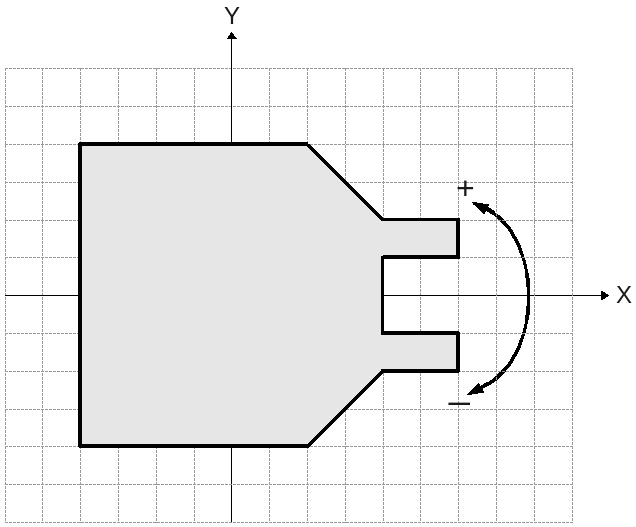
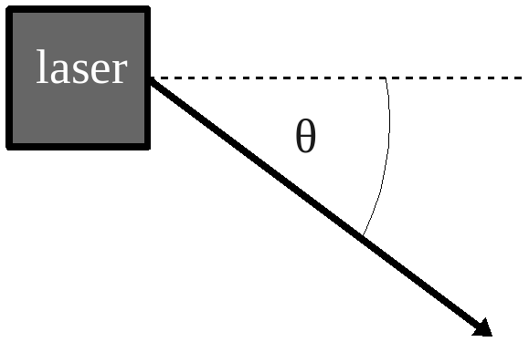
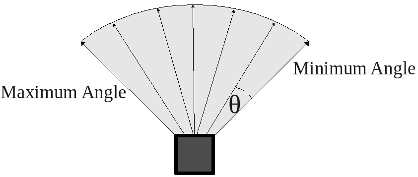
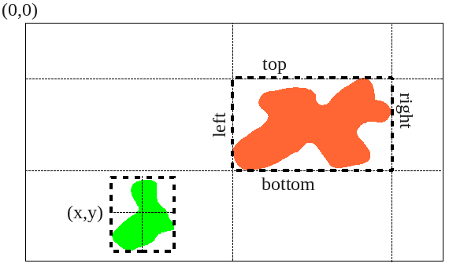

In [Chapter 6](CONTROLLER_CPP.md) only C++ was used as an example.  Since
Player interacts with controlling code over network sockets, it's pretty
easy to control robots (physical or simulated) with other languages as
well.  Player officially supports C++, C, and Python (see 
[http://playerstage.sourceforge.net/doc/Player-3.0.2/player/group__clientlibs.html](http://playerstage.sourceforge.net/doc/Player-3.0.2/player/group__clientlibs.html)).
There are also [Third party
libraries](http://playerstage.sourceforge.net/wiki/PlayerClientLibraries)
with support for clients ranging from Smalltalk to Java to MATLAB.

In this chapter, I will review the same examples given in
[Chapter 7](CONTROLLER_C.md) for Python, hilighting the differences in the
new language.  
Then, I will provide a new version of the 
case studies
[Trash Zapping Robot](CONTROLLER_C.md#75-using-proxies-case-study-1-using-c-for-a-trash-zapping-robot)
and
[Simulating Multiple Robots](CONTROLLER_C.md#76-case-study-2-simulating-multiple-robots)
for each.


# 9.1 - Coding in Python with `playerc.py`

## 9.1.1 - Setting up `playerc.py` interface

The C bindings are made by default in player.  To check to see if the bindings are available, and to locate where they are, type
```
locate playerc.py
```
and observe the path with `site-packages` in it's name.

## TRY IT OUT
```tiobox
> cd <source_code>/Ch9.1
> player simple.cfg &
> gedit simple.py &            (update /usr/local/lib/pyton2.7/site-packages to wherever you found playerc.py)
> python simple.py
```


# 9.2 Connecting to the Server and Proxies With Your Code

The first thing to do within your code is to include the Player interface
file. Assuming Player/Stage is installed correctly on your machine then
this can be done with the line 

```
from playerc import *
```

Next we need to establish a Player Client, which will interact with the
Player server for you. To do this we use the line:
```
robot = playerc_client(None, 'localhost',6665)

```
What this does is declare a new object which is a playerc_client called
`robot` which connects to the Player server at the given address. The
hostname and port is like that discussed in [Section 4.1 - Device Address](#41-device-addresses). If your code is running on the
same computer (or robot) as the Player server you wish to connect to then
the hostname is "localhost" otherwise it will be the IP address of the
computer or robot. The port will be the same as the port you gave in the
.cfg file.  So if you gave your first robot
port 6665 and the second one 6666 (like in the example of
[Section 4.2 - Putting the Configuration File Together](CFGFILES.md#42-putting-the-configuration-file-together)) then you would need two
player client, one connected to each robot, and you would do this with the
following code: 
```
robot1 = playerc_client(None, 'localhost',6665)
robot2 = playerc_client(None, 'localhost',6666)
```
Unlike in C, even if you are only using one robot and in your .cfg file you
still need to specify the port parameter.

Once we have established a player client we should connect our code to the
device proxies so that we can exchange information with them. Which proxies
you can connect your code to is dependent on what you have put in your
configuration file. For instance if your configuration file says your robot
is connected to a laser but not a camera you can connect to the laser
device but not the camera, even if the robot (or robot simulation) has a
camera on it. 

Proxies take the name of the interface which the drivers use to talk to
Player. Let's take part of the Bigbob example configuration file from
[Section 4.2 - Putting the Configuration File Together](CFGFILES.md#42-putting-the-configuration-file-together)):
```
driver
(
  name "stage"
  provides ["position2d:0" 
            "ranger:0" 
            "blobfinder:0" 
            "ranger:1" ]
)
```
Here we've told the Player server that our "robot" has devices which use the
position2d, ranger, and blobfinder interfaces. In our code then, we should
connect to the position2d, ranger, and blobfinder proxies like so:
```
position2d_name = playerc_position2d_create(client_name, index);
playerc_position2d_name.subscribe(position2d_name, PLAYER_OPEN_MODE);

sonar_name = playerc_ranger_create(client_name,index);
playerc_sonar_name.subscribe(sonar_name,PLAYER_OPEN_MODE);

blobfinder_name = playerc_blobfinder_create(client_name,index);
playerc_blobfinder_name.subscribe(blobfinder_name,PLAYER_OPEN_MODE);

laser_name = playerc_ranger_create(client_name,index);
playerc_laser_name.subscribe(laser_name,PLAYER_OPEN_MODE);
```
A full list of which proxies PlayerC supports can be found in the [Player
manual](http://playerstage.sourceforge.net/doc/Player-3.0.2/player/group__playerc__proxies.html)
They all follow the convention of being named after the interface they use.

In the above case `Proxy_name` is the name you want to give to the
proxy object, `client_name` is the name you gave the player client
object earlier and `index` is the index that the device was given in
your configuration file (probably 0).

## 9.2.1 - Setting Up Connections: an Example

For an example of how to connect to the Player sever and device proxies we
will use the example configuration file developed in 
[Section 4.2 - Putting the Configuration File Together](CFGFILES.md#42-putting-the-configuration-file-together). For convenience this is reproduced below:
```
driver
(		
      name "stage"
      plugin "stageplugin"

      provides ["simulation:0" ]

      # load the named file into the simulator
      worldfile "worldfile_name.world"	
)      

driver
(
      name "stage"
      provides ["6665:position2d:0" 
            "6665:ranger:0" 
            "6665:blobfinder:0" 
            "6665:ranger:1"]
      model "bob1" 
)
```

To set up a player client and then connect to proxies on that server we can
use principles discussed in this section to develop the following code:
```
from playerc import *

# Make proxies for Client, blobfinder
robot = playerc_client(None, 'localhost', 6665)
if robot.connect():
	raise Exception(playerc_error_str())

p = playerc_position2d(robot,0)
if p.subscribe(PLAYERC_OPEN_MODE):
	raise Exception(playerc_error_str())

s = playerc_ranger(robot,0)
if s.subscribe(PLAYERC_OPEN_MODE):
	raise Exception(playerc_error_str())

bf = playerc_blobfinder(robot,0);
if bf.subscribe(PLAYERC_OPEN_MODE):
	raise Exception(playerc_error_str())

l = playerc_ranger(robot,1)
if l.subscribe(PLAYERC_OPEN_MODE):
	raise Exception(playerc_error_str())

# some control code
return 0;
```

# 9.3 Interacting with Proxies 

As you may expect, each proxy is specialised towards controlling the device
it connects to. This means that each proxy will have different commands
depending on what it controls. 

In Player version 3.0.2 there are 39 different proxies which you can choose
to use, many of which are not applicable to Player/Stage. This manual will
not attempt to explain them all, a full list of avaliable proxies and their
functions is in the 
[Player manual](http://playerstage.sourceforge.net/doc/Player-3.0.2/player/group__playerc__proxies.html), although the returns, parameters and purpose of the proxy function is not always explained. 

The following few proxies are probably the most useful to anyone using
Player or Player/Stage.

## 9.3.1 position2dproxy
The position2dproxy is the number one most useful proxy there is. It
controls the robot's motors and keeps track of the robot's odometry (where
the robot thinks it is based on how far its wheels have moved).

### 9.3.1.1 - SetSpeed ( )
The SetSpeed command is used to tell the robot's motors how fast to turn.
There are three different SetSpeed commands that can be called, one is
for robots that can move in any direction (omnidirectional), one is for for
robots with differential drive (i.e. one drive wheel on each side), and the
last for car-like drives. 

* `set_cmd_vel (XSpeed, YSpeed, YawSpeed, int state)`
* `set_cmd_vel_head (XSpeed, YSpeed, YawHeading, state)`
* `set_cmd_car (XSpeed, SteerAngle)`


<!--- Figure --->
| |
| :---------------:| 
|  |
| Figure 9.3: A robot on a cartesian grid. This shows what directions the X and Y speeds will cause the robot to move in. A positive yaw speed will turn the robot in the direction of the + arrow, a negative yaw speed is the direction of the - arrow. |


Figure 9.3 shows which direction the x, y and yaw speeds are in relation to
the robot.  The x speed is the rate at which the robot moves forward and
the y speed is the robot's speed sideways, both are to be given in metres
per second. The y speed will only be useful if the robot you want to
simulate or control is a ball, since robots with wheels cannot move
sideways. The yaw speed controls how fast the robot is turning and is given
in radians per second, Python has an inbuilt global function called
`math.radians()` which converts a number in degrees into a number in
radians which could be useful when setting the yaw speed. 

If you want to simulate or control a robot with a differential drive system
then you'll need to convert left and right wheel speeds into a forward
speed and a turning speed before sending it to the proxy. For car-like
drives there is the `SetCarlike` which again is the forward speed in m/s
and the drive angle in radians.

### 9.3.1.2 - GetSpeed ( )

With playerc, there are no explicit GetSpeed comments - you just read from
the relevant fields in the `playerc_position2d_t` structure.

* `position2dProxy.vx`: forward speed (metres/sec).
* `position2dProxy.vy`: sideways (perpendicular) speed (metres/sec).
* `position2dProxy.va`: turning speed (radians/sec).

### 9.3.1.3 - Get_Pos ( )
Again, in playerc these fields are read directly from the `playerc_position2d_t`
structure.

This allows you to monitor where the robot thinks it is. Coordinate values
are given relative to its starting point, and yaws are relative to its
starting yaw. 

* `position2dProxy.px`: gives current x coordinate relative to its x starting position.
* `position2dProxy.py`: gives current y coordinate relative to its y starting position.
* `position2dProxy.pa`: gives current yaw relative to its starting yaw.

#### TRY IT OUT (GetSetPositions)
This example shows how to get and set positions.  
Read through the code before executing.  

```tiobox
> cd <source_code>/Ch9.3
> player bigbob7.cfg &
> player bigbob8_c.py
```

In [Section 3.2.1 - The Position Model](WORLDFILES.md#3217-position), we
specified whether player would record odometry by measuring how much the
robot's wheels have turned, or whether the robot would have perfect
knowledge of its current coordinates (by default the robot does not record
odometry at all).  If you set the robot to record odometry using its wheels
then the positions returned by these get commands will become increasingly
inaccurate as the simulation goes on. If you want to log your robots
position as it moves around, these functions along with the perfect
odometry can be used.

### 9.3.1.4 - Motor Enable( )
This function takes a boolean input, telling Player whether to enable the
motors or not. If the motors are disabled then the robot will not move no
matter what commands are given to it, if the motors are enabled then the
motors will always work, this is not so desirable if the robot is on a desk
or something and is likely to get damaged. Hence the motors being enabled
is optional. If you are using Player/Stage, then the motors will always be
enabled and this command doesn't need to be run. However, if your code is
ever likely to be moved onto a real robot and the motors are not explicitly
enabled in your code, then you may end up spending a long time trying to
work out why your robot is not working.

## 9.3.2 rangerproxy

A RangerProxy interfaces with any ranger sensor.  

A laser is represented by a ranger device with one ranger sensor, whose
`samples` attribute is greater than one.  To minimize confusion with
the depreciated laser interface, I'll refer to these as single-sensor
devices.  

A set of sonars or IR sensors is represented by a ranger device
with multiple ranger sensors whose `samples` attributes are not set (or
set to 1).  To minimize confusion with the depreciated sonar and IR
interfaces, I'll refer to these as multiple-sensor devices.

Angles are given with reference to the laser's centre front (see Figure
9.4).

* `get_geom()`: Retrieves the configuration of the ranger
  sensor, and fills in the [playerc_ranger_t](http://playerstage.sourceforge.net/doc/Player-3.0.2/player/structplayerc__ranger__t.html)
  structure.  The most useful elements of this structure are:
    * `ranges_count`: The number of ranger measurements that
      the sensor suite measures.  In the case of a single-sensor
      device, this is given by the `samples` attribute.  In the
      case of a multiple-sensor device, this is given by the number
      of sensors.
    * `ranges[ranger_number]`: 
          The range returned by the `ranger_number`*th* scan
          point. For a single-sensor device, scan points are numbered
          from the minimum angle at index 0, to the maximum angle at
          index `ranges_count`.
          For a multiple-sensor device, the `ranger_number` is
          given by the order in which you included the sensor.
    * `min_angle`: gives the minimum angle covered by a ranger sensor.
            Only makes sense for a single-sensor device.
			** Doesn't seem to work in the python interface.**
    * `max_angle`: gives the maximum angle covered by a
        ranger sensor.  Only makes sense for a single-sensor device.
			** Doesn't seem to work in the python interface.**
    * `bearings[ranger_number]`: scan bearings in the XY plane (See Figure
      7.4)

<!--- Figure --->
| |
| :---------------:| 
|  |
| Figure 9.4: How laser angles are referenced. In this diagram the laser is pointing to the right along the dotted line, the angle &theta; is the angle of a laser scan point, in this example &theta; is negative. |


<!--- Figure --->
| |
| :---------------:| 
|  |
| Figure 9.5: A laser scanner. The minimum angle is the angle of the rightmost laser scan, the maximum angle is the leftmost laser scan.  &theta; is the scan resolution of the laser, it is the angle between each laser scan, given in radians. |

#### TRY IT OUT (Ranger)
This example shows how ranger sensors can be read.
Read through the code before executing.  

```tiobox
> cd <source_code>/Ch9.3
> player bigbob7.cfg &
> python bigbob9_c.py
```

## 9.3.3 BlobfinderProxy 

The blobfinder module analyses a camera image for areas of a desired colour
and returns an array of the structure [`playerc_blobfinder_blob_t`](http://playerstage.sourceforge.net/doc/Player-3.0.2/player/structplayer__blobfinder__blob.html), this is
the structure used to store blob data. First we will cover how to get this
data from the blobfinder proxy, then we will discuss the data stored in the
structure.

* `GetCount()`: Returns the number of blobs seen.
* `blobProxy_name[blob_number]`: This returns the blob structure data for
  the blob with the index `blob_number`. Blobs are sorted by index in the
  order that they appear in the image from left to right. 
* `GetBlob(blob_number)`: same as `blobProxy_name[blob_number]`

Once we receive the blob structure from the proxy we can extract data we
need. The `playerc_blobfinder_blob_t` structure, documented in the [Player
manual](http://playerstage.sourceforge.net/doc/Player-3.0.2/player/structplayer__blobfinder__blob.html) 
contains the following fields (see Figure 6.6 for illustration):

> **BUG ALERT**
>
> Unfortunately, the C to Python interface doesn't do a good job at
> accessing data buried in C structures from python.  So you can't get at the
> properties of the blob.  

* `color`: The colour of the blob it detected. This is given as a hexadecimal value.
* `area`: The area of the blob's bounding box. (In
    Stage 4.1.1, there is a bug with respect to the area.  It is
    computed as an `int`, but return as an `unsigned int`.  In order to use
    it, you must explicitly cast it as an int (`(int)area`).  See
    (http://sourceforge.net/p/playerstage/bugs/362/) and/or
    (https://github.com/rtv/Stage/issues/41) for the details.)
* `x`: The horizontal coordinate of the geometric centre of the
  blob's bounding box
* `y`: The vertical coordinate of the geometric centre of the
  blob's bounding box 
* `left`: The horizontal coordinate of the left hand side of the
  blob's bounding box 
* `right`: The horizontal coordinate of the right hand side of the
  blob's bounding box 
* `top`: The vertical coordinate of the top side of the blob's
  bounding box
* `bottom`: The vertical coordinate of the bottom side of the
  blob's bounding box 


<!--- Figure --->
| |
| :---------------:| 
|  |
| Figure 9.6: What the fields in `playerc_blobfinder_blob_t` mean. The blob on the left has a geometric centre at *(x,y)*, the blob on the right has a bounding box with the top left corner at *(left, top)* pixels, and a lower right coordinate at *(right, bottom)* pixels. Coordinates are given with reference to the top left corner of the image. |

### TRY IT OUT (blobfinder)
This example shows how to extract info from a blobfinder.
Read through the code before executing.  
**Note: code not working.**

```tiobox
> cd <source_code>/Ch9.3
> player bigbob7.cfg &
> python bigbob10_c.py
```

## 9.3.4 - GripperProxy 
The GripperProxy allows you to control the gripper.  Once the gripper is
holding an item, the simulated robot will carry it around wherever it goes.
Without a gripper you can only jostle an item in the simulation and you
would have to manually tell the simulation what to do with an item. The
GripperProxy can also tell you if an item is between the gripper teeth
because the gripper model has inbuilt beams which can detect if they are
broken. 

* `open_cmd (playerc_gripper_t *device)`: 
      Tells the gripper to open. This will cause any items that were being carried to be dropped.
* `close_cmd (playerc_gripper_t *device)`: Command the gripper to close. 
      Tells the gripper to close. This will cause it to pick up anything between its teeth.
* `stop_cmd (playerc_gripper_t *device)`: Command the gripper to stop. If it is opening, it may not complete opening.  If it's closing, it may not complete closing.
* `printout (playerc_gripper_t *device, const char *prefix)`: Print a human-readable version of the gripper state. 
* `get_geom (playerc_gripper_t *device)`: Get the gripper
  geometry.  This is placed in the `playerc_gripper_t` structure, which 
  contains the following information:
    * `num_beams`: The number of breakbeams the gripper has. 
    * `state`: The gripper's state: may be one of PLAYER_GRIPPER_STATE_OPEN,
        PLAYER_GRIPPER_STATE_CLOSED, PLAYER_GRIPPER_STATE_MOVING or
        PLAYER_GRIPPER_STATE_ERROR. 
    * `beams`: The position of the object in the gripper. 
             This command will tell you if there is an item inside the
             gripper. If it is a value above 0 then there is an item to grab.

### TRY IT OUT (gripper)
This example shows a robot approaching a box, gripping it, and dragging it
backwards.
Read through the code before executing.  

```tiobox
> cd <source_code>/Ch9.3
> player bigbob11.cfg &
> python bigbob11_c.py
```

## 9.3.5 - SimulationProxy
The simulation proxy allows your code to interact with and change aspects of the simulation, such as an item's pose or its colour. 

### 9.3.5.1 - Get/Set Pose
The item's pose is a special case of the Get/SetProperty function, because
it is so likely that someone would want to move an item in the world they
created a special function to do it.

```
set_pose2d(item_name, x, y, yaw)
```

In this case `item_name` is as with Get/SetProperty, but we can directly
specify its new coordinates and yaw (coordinates and yaws are given with
reference to the map's origin).

```
rtn, x, y, a = get_pose(item_name)
```

This is like SetPose2d only this time it returns the given variables as
returns.


### TRY IT OUT (GetSetPose)
This example shows how to Get and Set pose of objects.
Read through the code before executing.  

```tiobox
> cd <source_code>/Ch9.3
> player bigbob11.cfg &
> python bigbob12_c.py
```

### 9.3.5.2 - Get/Set Property
In Stage 4.1.1 the Get/SetProperty simulation proxy functions
are only implemented for the property "color".  None of the other
properties are supported.  Previous versions of Stage (before 3.2.2) had
some code but it wasn't fully implemented, and it's been removed since.

If you desperately need this functionality you can use an earlier release
of Stage, and [the first edition of this manual](http://playerstage.sourceforge.net/doc/playerstage_instructions_2.0.pdf) describes how to get and
set a model's property in those distributions.  

In this edition of the manual I will describe the only functioning
Get/SetProperty, which is "color".

To change a property of an item in the simulation we use the following function:

```
GetProperty(item_name, property, *value, value_len)
SetProperty(item_name, property, *value, value_len)
```

> ** BUG ALERT **
> Unfortunately, the C to Python interface doesn't do a good job at
> accessing data behind a pointer.  So you can't get at the
> data within the *value.  

* `item_name`: this is the name that you gave to the object in the
  worldfile, it could be *any* model that you have described in the
  worldfile. For example, in [Section 3.2.2 - An Example Robot](WORLDFILES.md#322-an-example-robot) in the
  worldfile we declared a Bigbob type robot which we called
  "bob1" so the `item_name` for that object is "bob1". Similarly
  in [Section 3.2.3 - Building Other Stuff](WORLDFILES.md#323-building-other-stuff) we built some
  models of oranges and called the "orange1" to "orange4" so
  the item name for one of these would be "orange1". Anything
  that is a model in your worldfile can be altered by this
  function, you just need to have named it, no drivers need to be
  declared in the configuration file for this to work either. We
  didn't write controllers for the oranges but we could still alter
  their properties this way.
* `property`: Currently, `"_mp_color"` is the only supported propery about
   a model that you can change.  
* `value`: a pointer to the value you want fill with the property or assign to the property (see below).
* `value_len`: is the size of the value you gave in bytes. 

The `value` parameter is dependant on which `property` you want to set.

* `"color"`: This requires an array of four `float` values, scaled between
  0 and 1. The first index of the array is the red component of the colour,
  the second is the green, third is blue and fourth is alpha (how light or
  dark the colour is, usually 1). For example if we want a nice shade of
  green, which has RGB components 171/224/110 we scale these between 0 and
  1 by dividing by 255 to get 0.67/0.88/0.43 we can now put this into a
  float array with the line `float green[]={0.67, 0.88, 0.43, 1};`. This
  array can then be passed into our `SetProperty` function like so:
`SetProperty("model_name", "color", (void*)green, sizeof(float)*4 );`

### TRY IT OUT (GetSetProperty)
This example shows how to reset the color of an object.
Read through the code before executing.  

** NONFUNCTIONAL**
```tiobox
> cd <source_code>/Ch9.3
> player bigbob11.cfg &
> python bigbob13_c.py
```

# 9.4 General Useful Commands

## 9.4.1 - read()
To make the proxies update with new sensor data we need to tell the player
server to update, we can do this using the player client object which we
used to connect to the server. All we have to do is run the command
`playerClient_name.read()` every time the data needs updating (where
playerClient_name is the name you gave the player client object).
Until this command is run, the proxies and any sensor information from them
will be empty. 

The devices on a typical robot are asynchronous and the devices in a
Player/Stage simulation are also asynchronous, so running the `Read()`
command won't always update everything at the same time, so it may take
several calls before some large data structures (such as a camera image)
    gets updated.

## 9.4.2 - GetGeom( )
Most of the proxies have a function called `get_geom` or `get_geometry` or
`request_geometry`, or words to that effect. What these functions do is tell
the proxy to retrieve information about the device, usually its size and pose
(relative to the robot). The proxies don't know this by default since this
information is specific to the robot or the Player/Stage robot model. If
your code needs to know this kind of information about a device then the
proxy must run this command first.

# 9.5 Case Study 1: Using Python for a Trash-Zapping Robot

This case study is not yet ported to python, due to the inability to access data
within the blobdata structure.

# 9.6 Case Study 2: Simulating Multiple Robots

Our robot simulation case study only shows how to simulate a single robot in a Player/Stage environment. It's highly likely that a simulation might want more than one robot in it. In this situation you will need to build a model of every robot you need in the worldfile, and then its associated driver in the configuration file. Let's take a look at our worldfile for the case study, we'll add a new model of a new Bigbob robot called "bob2":
```
bigbob
(
	name "bob1"
	pose [-5 -6 45]
	color "green"
)

bigbob
(
	name "bob2"
	pose [5 6 225]
	color "yellow"
)
```
If there are multiple robots in the simulation, the standard practice is to
put each robot on its own port (see [Device Address](CFGFILES.md#sec_ConfigurationFile_DeviceAddress)). To implement this in the configuration file we need to tell Player which port to find our second robot on:
```
driver( name "stage" 
        provides ["6665:position2d:0" "6665:ranger:0"
        "6665:blobfinder:0" "6665:ranger:1"] 
        model "bob1" )

driver( name "stage" 
        provides ["6666:position2d:0" "6666:ranger:0"
        "6666:blobfinder:0" "6666:ranger:1"] 
        model "bob2" )
```
If you plan on simulating a large number of robots then it is probably worth writing a script to generate the world and configuration files.

When Player/Stage is started, the Player server automatically connects to
all the ports used in your simulation and you control the robots separately
with different player client objects in your code. For instance:
```
# first robot
robot = playerc_client(None, 'localhost', 6665)
if robot.connect():
	raise Exception(playerc_error_str())
sp = playerc_ranger(robot,0)
if sp.subscribe(PLAYERC_OPEN_MODE):
	raise Exception(playerc_error_str())
lp = playerc_ranger(robot,1)
if lp.subscribe(PLAYERC_OPEN_MODE):
	raise Exception(playerc_error_str())
pp = playerc_position2d(robot,0)
if pp.subscribe(PLAYERC_OPEN_MODE):
	raise Exception(playerc_error_str())

//second robot
robot2 = playerc_client(None, 'localhost', 6666)
if robot2.connect():
	raise Exception(playerc_error_str())
sp2 = playerc_ranger(robot2,0)
if sp2.subscribe(PLAYERC_OPEN_MODE):
	raise Exception(playerc_error_str())
lp2 = playerc_ranger(robot2,1)
if lp2.subscribe(PLAYERC_OPEN_MODE):
	raise Exception(playerc_error_str())
pp2 = playerc_position2d(robot2,0)
if pp2.subscribe(PLAYERC_OPEN_MODE):
	raise Exception(playerc_error_str())

```
Each player client represents a robot, this is why when you connect to a proxy
the player client is a constructor parameter. Each robot has a proxy for
each of its devices, no robots share a proxy, so it is important that your
code connects to every proxy of every robot in order to read the sensor
information.

How you handle the extra player client and proxies is dependent on the
scale of the simulation and your own personal coding preferences. It's a
good idea, if there's more than maybe 2 robots in the simulation, to make a
robot class which deals with connecting to proxies and the server, and
processes all the information internally to control the robot. Then you can
create an instance of this class for each simulated
robot (obviously the robot's port number would need to be a
parameter otherwise they'll all connect to the same port and consequently
the same robot.) and all the simulated robots will run the same code.

An alternative to using a port for each robot is to use the same port but a
different index. 

For example, the Bigbob robot uses interfaces and indexes: position2d:0,
ranger:0, blobfinder:0 and ranger:0. If we configured two Bigbob robots to
use the same port but a different index our configuration file would be
like this: 
```
driver( name "stage" 
        provides ["6665:position2d:0" "6665:ranger:0" 
        "6665:blobfinder:0" "6665:ranger:1"] 
        model "bob1" )

driver( name "stage" 
        provides ["6665:position2d:1" "6665:ranger:2" 
        "6665:blobfinder:1" "6665:ranger:3"] 
        model "bob2" )
```
In our code we could then establish the proxies using only one player
client:
```
# first robot
robot = playerc_client(None, 'localhost', 6665)
if robot.connect():
	raise Exception(playerc_error_str())
sp = playerc_ranger(robot,0)
if sp.subscribe(PLAYERC_OPEN_MODE):
	raise Exception(playerc_error_str())
lp = playerc_ranger(robot,1)
if lp.subscribe(PLAYERC_OPEN_MODE):
	raise Exception(playerc_error_str())
pp = playerc_position2d(robot,0)
if pp.subscribe(PLAYERC_OPEN_MODE):
	raise Exception(playerc_error_str())

# second robot
sp2 = playerc_ranger(robot,2)
if sp2.subscribe(PLAYERC_OPEN_MODE):
	raise Exception(playerc_error_str())
lp2 = playerc_ranger(robot,3)
if lp2.subscribe(PLAYERC_OPEN_MODE):
	raise Exception(playerc_error_str())
pp2 = playerc_position2d(robot,1)
if pp2.subscribe(PLAYERC_OPEN_MODE):
	raise Exception(playerc_error_str())

# shared simulation proxy
simp = playerc_simulation(robot,0)
if simp.subscribe(PLAYERC_OPEN_MODE):
	raise Exception(playerc_error_str())
```
The main advantage of configuring the robot swarm this way is that it
allows us to only have one simulation proxy which is used by all robots.
This is good since there is only ever one simulation window that you can
interact with and so multiple simulation proxies are unnecessary and
confusing.

